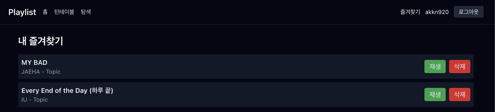

# Playlist
> 음악 탐색/재생/추천 데모 앱입니다.  
> Codex(OpenAI key) 기반으로 터미널 환경에서 작업한 예제입니다. 

---
## 화면 예시
| Login | Sign Up |
|-------|---------|
|  |  |

| Main | Favorites |
|------|-----------|
|  |  |


---
## 목차

- [개요](#개요)
- [핵심 기능](#핵심-기능)
- [기술 스택](#기술-스택)
- [디렉터리 구조 (요약)](#프로젝트-구조-요약)
- [설치 및 실행](#설치-및-실행)
- [데이터 파일](#데이터-파일)
- [뉴스(NewsAPI)](#뉴스newsapi)
- [YouTube 검색/재생](#youtube-검색재생)


---
## 개요
- 목적: 음악 검색(YouTube 연동), 미리듣기(mp3), 재생 시각화, 감정/모드 기반 추천, 즐겨찾기/간단한 인증(데모) 제공  
- 데모용으로 로컬 파일(`data/*.json`)에 사용자/즐겨찾기 정보를 저장합니다. (프로덕션용 아님)


---
## 핵심 기능
- 트랙 검색(YouTube API 연동 가능)  
- 재생: Howler 기반 오디오 재생과 YouTube 임베디드(iframe) 재생 지원  
- 재생 시 시각화(AnalyserNode 혹은 YouTube 모의 동기화)  
- 추천 API(간단한 mock) 및 모드/장르 필터  
- 즐겨찾기(로그인 후 파일 저장)  


---
## 기술 스택

<table>
  <tr>
    <td align="center"><strong>Frontend</strong></td>
    <td>
      
      
      
    </td>
  </tr>
  <tr>
    <td align="center"><strong>Styling</strong></td>
    <td>
      
    </td>
  </tr>
  <tr>
    <td align="center"><strong>Audio/Media</strong></td>
    <td>
      
      
      
    </td>
  </tr>
  <tr>
    <td align="center"><strong>Backend/Runtime</strong></td>
    <td>
      
    </td>
  </tr>
  <tr>
    <td align="center"><strong>Deploy</strong></td>
    <td>
      
    </td>
  </tr>
</table>

---
## 프로젝트 구조 (요약)

```bash
playlist/
├── apps/web/ # Next.js 앱(프론트엔드)
│ ├── app/ # App Router 페이지
│ ├── components/ # UI 컴포넌트
│ ├── lib/ # 서버/클라이언트 공용 유틸
│ ├── app/api/ # 간단한 API (tracks, news, auth, favorites)
│ └── public/ # 정적 에셋
├── data/ # 런타임에 생성되는 사용자/즐겨찾기 파일 (gitignore 됨)
└── README.md # (이 파일)
```


---
## 환경 변수
앱에서 외부 API 연동(YouTube, NewsAPI 등)을 하려면 루트 또는 `apps/web` 안에 `.env.local` 파일을 생성하세요.
예시 `.env.local`:
```bash
YOUTUBE_API_KEY=여기에_유튜브_API_KEY
NEWSAPI_KEY=여기에_NEWSAPI_KEY
```

#### (옵션) NEXT_PUBLIC_... 같은 공개용 변수가 필요하면 추가

> 주의: 절대 실제 키를 퍼블릭 레포에 커밋하지 마세요. `.gitignore`에 이미 `.env*`와 `data/`가 포함되어 있습니다.

---
## 설치 및 실행

프로젝트 루트에서 `playlist/apps/web`로 이동해 실행합니다.

```bash
cd playlist/apps/web
# 의존성 설치 (pnpm 권장)
pnpm install
# 개발 서버 (포트 충돌 발생 시 PORT=3001 pnpm dev)
pnpm dev
```
브라우저에서 http://localhost:3000 또는 설정한 포트로 접속하세요.

---
## 데이터 파일

data/users.json : 데모 사용자 계정 저장

data/favorites.json : 사용자별 즐겨찾기 매핑

앱은 데모 목적의 로컬 파일 저장을 사용합니다. 운영 환경에서는 DB로 교체하세요.

---
## 뉴스(NewsAPI)

NEWSAPI_KEY가 설정되어 있으면 서버에서 NewsAPI.org로 프록시 요청을 합니다.

설정되어 있지 않으면 mock 뉴스가 검색어/장르 기반으로 제공됩니다.

---
## YouTube 검색/재생

YOUTUBE_API_KEY를 .env.local에 추가하면 /api/tracks?q=... 요청에서 YouTube 검색 결과를 우선 반환합니다.

YouTube 영상은 임베디드 플레이어로 재생되며, cross-origin 제약으로 인해 브라우저 WebAudio API로 직접 오디오를 분석할 수 없습니다. 대신 재생 시간에 동기화된 시각화(모의 웨이브)를 제공합니다.
